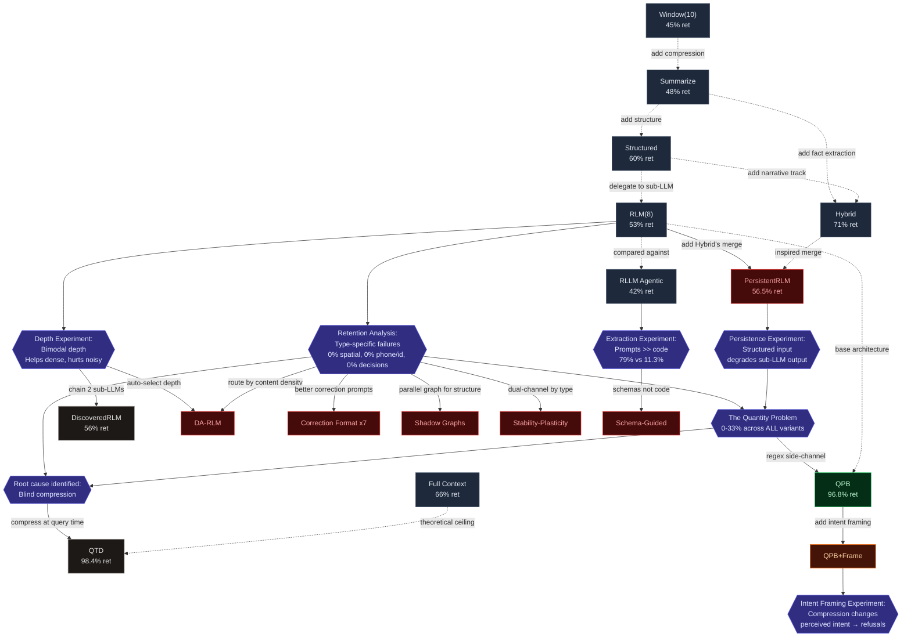

# What LLMs Forget

### Benchmarking Long-Context Memory Strategies: Why Deeper Delegation Beats Agentic Code

---

## The Problem

Large language models forget. Not gracefully — catastrophically. When an agent runs for 50+ conversational turns, the context window fills up and something has to give. Every long-context memory strategy is a bet on what to keep and what to lose. Get the bet wrong and your agent forgets a phone number, ignores a correction, or hallucinates a budget figure that was updated three turns ago.

The field has produced increasingly sophisticated solutions — from sliding windows to recursive summarization to neuroscience-inspired memory architectures like EverMemOS. But a basic question remains underexplored: **what types of information do these strategies actually lose, and when?**

We built a benchmark to find out. Then we found something we didn't expect.

---

## The Benchmark

### 8 Scenarios, 8 Failure Modes

We designed eight conversational scenarios, each targeting a specific way memory can fail:

| #   | Scenario                 | Steps | What It Tests                                                       |
| --- | ------------------------ | ----- | ------------------------------------------------------------------- |
| 1   | Early Fact Recall        | 20    | Remembering details from message 1 after 20+ exchanges              |
| 2   | State Change Tracking    | 15    | Tracking inventory across cumulative updates                        |
| 3   | Contradiction Resolution | 15    | Handling explicit corrections ("actually, change the hotel to...")  |
| 4   | Multi-hop Reasoning      | 15    | Computing answers that require combining facts from different turns |
| 5   | Long Horizon + Noise     | 20    | Extracting signal from irrelevant chit-chat                         |
| 6   | Cascading Corrections    | 14    | Following corrections that change downstream calculations           |
| 7   | Implicit Corrections     | 16    | Detecting corrections without signal words ("actually", "wait")     |
| 8   | Rapid-fire Corrections   | 16    | Tracking 15+ rapid changes to a wedding seating chart               |

Each scenario plays out as a multi-turn conversation. The agent receives information incrementally, then faces a final question that requires synthesizing everything it was told. A regex-based checker validates the answer against ground truth.

### Probes: Measuring What Disappears

Beyond pass/fail scoring, we instrumented each scenario with **probes** — specific facts tagged by type that we can search for in the strategy's internal state. Each probe has:

- A **fact** (e.g., "Kenji's phone 090-8765-4321")
- A **type** (`entity`, `phone/id`, `quantity`, `date`, `correction`, `spatial`, `relationship`, `decision`)
- **Patterns** to match (all must be present for the probe to count as retained)
- The **step** where the fact was introduced

62 probes across 8 scenarios. This lets us answer not just "did the strategy pass?" but "which specific facts survived compression, and which didn't?"

---

## The Leaderboard

We tested 8 strategies on Claude Haiku 4.5 (via OpenRouter), then re-ran the full leaderboard on gpt-5-nano (via OpenCode Zen) for same-model comparison with agentic extraction. Results below are from gpt-5-nano:

| Strategy          | Accuracy    | Retention | Approach                                      |
| ----------------- | ----------- | --------- | --------------------------------------------- |
| **Hybrid**        | 7/8 (88%)   | 71%       | Extract facts + narrative summary in parallel |
| **Full Context**  | 7/8 (88%)   | 66%       | No compression — send everything              |
| **Structured(8)** | 6/8 (75%)   | 60%       | Key-value fact extraction                     |
| **RLM(8)**        | 5/8 (63%)   | 53%       | Delegate to sub-LLM with targeted questions   |
| **DiscoveredRLM** | 4/8 (50%)   | 56%       | LLM-inspired 2-pass extract + verify          |
| **Summarize(8)**  | 3/8 (38%)   | 48%       | Compress old messages into a summary          |
| **RLLM**          | 3/8 (38%)   | 42%       | Agentic code-execution extraction             |
| **Window(10)**    | 2/8 (25%)\* | 45%       | Keep last 10 messages, drop the rest          |

_\*Window(10) had 4 connection errors — true score likely higher._

### Per-Scenario Pass/Fail Grid

| Scenario                 | Full Context | Hybrid | Structured | RLM(8) | DiscoveredRLM | Summarize | RLLM | Window(10) |
| ------------------------ | ------------ | ------ | ---------- | ------ | ------------- | --------- | ---- | ---------- |
| Early Fact Recall        | PASS         | PASS   | PASS       | FAIL   | FAIL          | FAIL      | FAIL | FAIL       |
| State Change Tracking    | PASS         | PASS   | PASS       | PASS   | PASS          | FAIL      | PASS | PASS       |
| Contradiction Resolution | FAIL         | PASS   | FAIL       | FAIL   | FAIL          | FAIL      | FAIL | ERR        |
| Multi-hop Reasoning      | PASS         | PASS   | PASS       | PASS   | PASS          | FAIL      | FAIL | ERR        |
| Long Horizon + Noise     | PASS         | PASS   | PASS       | PASS   | FAIL          | PASS      | FAIL | ERR        |
| Cascading Corrections    | PASS         | PASS   | PASS       | PASS   | PASS          | PASS      | PASS | ERR        |
| Implicit Corrections     | PASS         | FAIL   | FAIL       | FAIL   | FAIL          | FAIL      | FAIL | FAIL       |
| Rapid-fire Corrections   | PASS         | PASS   | PASS       | PASS   | PASS          | PASS      | PASS | PASS       |

Implicit Corrections is the hardest scenario — only Full Context passes it. Contradiction Resolution trips up even Full Context on nano (it passes on Haiku), confirming this is a model reasoning limit, not a memory limit. Cascading Corrections and Rapid-fire Corrections are the easiest — most strategies pass both.

### Model Matters

gpt-5-nano is a weaker model than Haiku. The rankings shifted:

- **Full Context dropped from 100% to 88%** — even with all messages present, the smaller model fails Contradiction Resolution. This means nano has weaker inherent reasoning, not just weaker compression.
- **Hybrid held steady at the top** — its dual-track architecture is robust across model sizes.
- **Structured jumped from 63% to 75%** — key-value extraction plays to nano's pattern-matching strengths.
- **Summarize dropped from 75% to 38%** — narrative summarization degrades sharply on a weaker model.

### What Separates the Winners

**Hybrid** (7/8) works because it runs two tracks in parallel: one extracts facts as natural-language sentences (preserving relationships like "Floor 3 has a conference room with capacity 50"), while the other produces a narrative summary. Neither track alone reaches the top — the combination does.

**RLM** (5/8) uses a fundamentally different approach. Instead of summarizing, it delegates old messages to a sub-LLM with five targeted questions (ENTITIES, DECISIONS, CORRECTIONS, NUMBERS, CURRENT STATE). On nano, it drops to 63% accuracy but its probe retention (53%) remains competitive — it preserves information even when the final answer is wrong.

**Sliding Window** (2/8) is the baseline everyone uses in production. It works until it doesn't — anything older than the window is gone forever.

---

## Zooming Into RLM

RLM scored 7/8, but that number hides a deeper story. Using our probe framework, we ran the **Retention Analysis**: a full information-loss analysis that tracked every probe through every delegation cycle.

### Retention by Fact Type

| Type             | Retention | Probes Lost | What This Means                                    |
| ---------------- | --------- | ----------- | -------------------------------------------------- |
| **spatial**      | 0%        | 3/3         | Floor plans, regions, locations — completely wiped |
| **decision**     | 0%        | 1/1         | "We chose X over Y" — gone                         |
| **phone/id**     | 0%        | 7/7         | Phone numbers, policy IDs, codes — zeroed out      |
| **quantity**     | 12%       | 15/17       | Dollar amounts, counts, rates — nearly all lost    |
| **entity**       | 25%       | 6/8         | People, products, organizations — most lost        |
| **relationship** | 33%       | 2/3         | "X is part of Y" — fragile                         |
| **correction**   | 45%       | 11/20       | "Changed from A to B" — half survive               |
| **date**         | 67%       | 1/3         | Dates and deadlines — best retained                |

The sub-LLM's five targeted questions specifically ask for corrections and numbers, which explains why corrections fare relatively well. But phone numbers, IDs, and spatial information get dropped despite the ENTITIES and NUMBERS questions covering them. The sub-LLM treats them as lower priority than names and dates.

### The Non-Monotonic Retention Curve

A surprise in the data: probes often show `LOST` at cycle 1, then `RETAINED` at cycles 2-3, then `LOST` again at cycles 4-5.

This isn't the sub-LLM "learning." Cycle 1 processes raw conversation (messy, easy to miss details). Cycles 2-3 process the sub-LLM's own structured output (organized under ENTITIES, NUMBERS, etc. — easier to copy forward). But cycles 4-5 show compounding loss catching up as the structured output gets re-compressed through successive delegations.

---

## The Depth Experiment

This is where it gets interesting.

Standard RLM uses **depth 1**: one sub-LLM call per compression cycle. We built a DeepRLM variant that chains N sub-LLM calls — depth 2 means the first sub-LLM's output gets re-processed by a second sub-LLM with the same targeted questions.

**The hypothesis:** Compounding loss. Each pass should degrade the information further, like photocopying a photocopy.

**The actual result:**

| Scenario                 | Depth 1           | Depth 2           | Delta      |
| ------------------------ | ----------------- | ----------------- | ---------- |
| Early Fact Recall        | 1/10              | 8/10              | **+7**     |
| State Change Tracking    | 2/7               | 3/7               | +1         |
| Contradiction Resolution | 4/8               | 4/8               | 0          |
| Multi-hop Reasoning      | 6/8               | 7/8               | +1         |
| Long Horizon + Noise     | 7/8               | 3/8               | **-4**     |
| Cascading Corrections    | 5/7               | 4/7               | -1         |
| Implicit Corrections     | 6/7               | 5/7               | -1         |
| Rapid-fire Corrections   | 6/7               | 7/7               | +1         |
| **Total**                | **37/62 (59.7%)** | **41/62 (66.1%)** | **+6.4pp** |

Depth 2 is **net positive**. Overall retention improved from 59.7% to 66.1%.

### Two Modes

The data reveals that depth 2 has two distinct effects depending on the scenario:

**Self-correction mode** (4 scenarios improved): The second sub-LLM pass reads the first pass's structured output and catches facts that the first pass missed when processing raw conversation. Early Fact Recall jumped from 1/10 to 8/10 — the first pass dropped early project details buried under 20 turns of subsequent conversation, but the second pass, working from an organized knowledge extraction, recovered them.

**Noise amplification mode** (3 scenarios degraded): For scenarios with lots of noise or rapid changes, the second pass amplifies confusion. Long Horizon + Noise dropped from 7/8 to 3/8 — the first pass successfully filtered signal from noise, but the second pass, seeing only the extraction (where signal and noise are flattened into the same format), couldn't distinguish them.

---

## The Agentic Extraction Experiment

The Retention Analysis and the Depth Experiment showed that hand-designed prompts work surprisingly well for memory extraction. But what if we gave the LLM _more freedom_ — let it write and execute its own extraction code? The [rllm](https://github.com/nicholasoxford/rllm) package enables exactly this: the LLM generates JavaScript that runs in a V8 isolate to extract facts from conversation transcripts.

**The hypothesis:** A code-writing LLM should outperform fixed prompts. It can adapt its extraction strategy to the content — using regex for phone numbers, structured parsing for corrections, categorization for entities. The prompt-based approach is a rigid template; code is flexible.

### The Extraction Experiment: RLLM vs Hand-Rolled RLM (Same Model)

We ran both strategies on gpt-5-nano via OpenCode Zen to eliminate the model confound.

| Scenario                 | Hand-rolled RLM   | RLLM Agentic     | Delta       |
| ------------------------ | ----------------- | ---------------- | ----------- |
| Early Fact Recall        | 8/10 (80%)        | 0/10 (0%)        | +80pp       |
| State Change Tracking    | 5/7 (71%)         | 0/7 (0%)         | +71pp       |
| Contradiction Resolution | 6/8 (75%)         | 0/8 (0%)         | +75pp       |
| Multi-hop Reasoning      | 7/8 (88%)         | 0/8 (0%)         | +88pp       |
| Long Horizon + Noise     | 5/8 (63%)         | 0/8 (0%)         | +63pp       |
| Cascading Corrections    | 6/7 (86%)         | 2/7 (29%)        | +57pp       |
| Implicit Corrections     | 6/7 (86%)         | 0/7 (0%)         | +86pp       |
| Rapid-fire Corrections   | 6/7 (86%)         | 5/7 (71%)        | +15pp       |
| **OVERALL**              | **49/62 (79.0%)** | **7/62 (11.3%)** | **+67.7pp** |

The hand-rolled approach dominates on every scenario. RLLM agentic retains 11.3% versus 79.0% — a 67.7 percentage-point gap. In 6 of 8 scenarios, RLLM retained exactly 0 facts.

The only scenarios where RLLM showed any retention were Cascading Corrections (2/7) and Rapid-fire Corrections (5/7) — both involve highly structured, repetitive updates that the LLM's generated code could sometimes parse.

### The Code Analysis: What Code Did the LLM Write?

We captured all 168 code blocks that gpt-5-nano generated across the 8 scenarios. Offline classification revealed three distinct strategy families:

| Strategy                | % of Code Blocks | Description                                                     |
| ----------------------- | ---------------- | --------------------------------------------------------------- |
| **type_specific**       | 29%              | Attempts category-based extraction (entities, quantities, etc.) |
| **flat_extraction**     | 13%              | Simple line-by-line parsing with minimal structure              |
| **chunking**            | ~5%              | Splits transcript into chunks for batch processing              |
| **unknown/ineffective** | 53%              | Malformed, incomplete, or non-functional code                   |

The LLM _recognized_ it needed type-specific extraction — mirroring the structure of our hand-rolled 5-question prompt. But over half the code it produced was non-functional. The code that did run tended to parse surface patterns (regex for numbers, string matching for names) without understanding conversational context like corrections or state changes.

### Why Code Fails Where Prompts Succeed

The 5-question prompt works because it delegates to the LLM's _language understanding_ capabilities — asking it to comprehend the conversation and extract meaning. The code-generation approach forces the LLM through an unnecessary indirection: first understand the extraction task, then express that understanding as JavaScript, then hope the JavaScript correctly implements the understanding.

For fact extraction from natural language, the LLM already _is_ the ideal tool. Making it write code to do what it can already do with language is like asking a translator to write a translation program instead of just translating.

---

## The Persistent Stores Experiment

The first four experiments identified RLM's root cause: `this.delegatedKnowledge = [subLLMResult.content]` — wholesale replacement. Every compression cycle, the sub-LLM's output completely replaces whatever was stored before. If the sub-LLM drops a fact in cycle N, it's gone forever, even if it was faithfully carried through cycles 1 through N-1.

The fix seemed obvious: borrow Hybrid's incremental merge. Parse the sub-LLM's output into typed stores (identifiers, entities, quantities, dates, corrections, structural) and merge new extractions into persistent maps. Same sub-LLM call, same cost — just parse-then-merge instead of wholesale replace.

### The Persistence Experiment: PersistentRLM vs RLM (Same Model)

We built PersistentRLM with 6 typed stores, a section parser with 25 alias mappings, an overflow bucket for unsectioned content, and multi-line entry handling. Then ran it head-to-head against base RLM on gpt-5-nano.

**The hypothesis:** Incremental persistence eliminates the copy-forward failure. Facts the sub-LLM drops in one cycle survive from previous cycles.

**The actual result:**

| Scenario                 | RLM(8)        | PersistentRLM | Delta  |
| ------------------------ | ------------- | ------------- | ------ |
| Early Fact Recall        | PASS          | PASS          | —      |
| State Change Tracking    | **PASS**      | FAIL          | **-1** |
| Contradiction Resolution | PASS          | PASS          | —      |
| Multi-hop Reasoning      | PASS          | PASS          | —      |
| Long Horizon + Noise     | PASS          | PASS          | —      |
| Cascading Corrections    | PASS          | PASS          | —      |
| Implicit Corrections     | FAIL          | FAIL          | —      |
| Rapid-fire Corrections   | PASS          | PASS          | —      |
| **Total**                | **7/8 (88%)** | **6/8 (75%)** | **-1** |

PersistentRLM is strictly worse. It lost State Change Tracking (Gadget-X: 0 instead of 200 clearance units) while gaining nothing.

### Probe-Level Retention

| Type             | RLM(8)            | PersistentRLM     | Delta      |
| ---------------- | ----------------- | ----------------- | ---------- |
| **spatial**      | 33% (1/3)         | 0% (0/3)          | **-33pp**  |
| **decision**     | 100% (1/1)        | 0% (0/1)          | **-100pp** |
| **quantity**     | 24% (4/17)        | 18% (3/17)        | -6pp       |
| **entity**       | 63% (5/8)         | 63% (5/8)         | 0          |
| **relationship** | 67% (2/3)         | 67% (2/3)         | 0          |
| **correction**   | 85% (17/20)       | 80% (16/20)       | -5pp       |
| **phone/id**     | 86% (6/7)         | 86% (6/7)         | 0          |
| **date**         | 100% (3/3)        | 100% (3/3)        | 0          |
| **TOTAL**        | **62.9% (39/62)** | **56.5% (35/62)** | **-6.4pp** |

Zero probes where PersistentRLM wins. Four probes where base RLM wins:

1. Gadget-X discontinued/clearance (decision) — status qualifier lost during structured extraction
2. Floor 3 conference room 50 people (spatial) — spatial facts dropped to 0%
3. 3 catered meals (quantity) — quantity association lost
4. 30 ladyfingers corrected from 24 (correction) — correction not carried forward

### Why Persistence Made Things Worse

The hypothesis assumed wholesale replacement was the bottleneck. It wasn't. The bottleneck is the sub-LLM's extraction quality, and the structured format actively degrades it.

**The mechanism:** When the sub-LLM receives base RLM's natural-language blob as "previously extracted knowledge," it processes it with full language understanding — recognizing that "Gadget-X moved to clearance, count unchanged at 200" is a single compound fact. When it receives PersistentRLM's typed stores (`QUANTITIES: - Gadget-X: 200 units` and `STRUCTURAL: - Gadget-X: moved to clearance`), it treats them as independent facts. The structured format _splits associations that the sub-LLM would naturally keep together_.

This is the inverse of the CTX-3 finding. In CTX-3, we learned that prompts beat code because code adds indirection. Here, typed stores beat natural language at _storage_ but lose at _re-ingestion_ — the sub-LLM processes its own structured output worse than its own natural-language output. The structure that helps humans parse information constrains the LLM's ability to maintain cross-category associations.

**Token cost:** PersistentRLM was cheaper (432K vs 516K total tokens) because serialized stores are more compact. But cheaper doesn't help if accuracy drops.

### Implication: Format Determines Extraction Quality

The sub-LLM's input format is not neutral. It shapes what the sub-LLM attends to and how it organizes its output. Feeding it structured sections causes it to produce structured sections — and in doing so, it fragments facts that naturally span categories. A warehouse item's quantity (200), status (clearance), and history (discontinued) are one fact in natural language but three entries in three stores.

This suggests the right architecture isn't "parse output into stores" but rather "keep the natural-language blob AND maintain a side-channel for facts that the blob historically drops." That's closer to what Hybrid does — dual track, not parse-and-split.

---

## The Proposal Feasibility Probes

The first five experiments identified RLM's weaknesses — type-specific retention gaps, the depth tradeoff, code vs prompts, and the format sensitivity trap. The natural next question: **can we fix RLM's retention gaps with targeted architectural changes?**

We selected 5 proposals from a set of 10 research directions and built lightweight feasibility probes for each — two-phase experiments that test core assumptions before committing to full implementation. Phase 1 validates the proposal's central mechanism at zero LLM cost (regex, parsing, classification). Phase 2 runs targeted benchmarks only if Phase 1 passes. Kill criteria stop early when the data says the idea is dead.

### Five Proposals, Five Verdicts

| #   | Proposal                      | Core Idea                                             | Phase 1                     | Phase 2                | Verdict      |
| --- | ----------------------------- | ----------------------------------------------------- | --------------------------- | ---------------------- | ------------ |
| 1   | Depth-Adaptive RLM            | Route to depth 1/2/3 based on content signals         | FAIL (50% routing accuracy) | skipped                | ABANDON      |
| 2   | Correction Format Engineering | Test 7 correction prompt formats                      | n/a                         | KILL (0pp spread)      | ABANDON      |
| 3   | Structural Shadow Graphs      | Maintain a parallel knowledge graph alongside RLM     | PASS (75% capture)          | +4pp avg               | ABANDON      |
| 5   | Stability-Plasticity          | Separate stable facts (phones, IDs) from plastic ones | PASS (100% recall, CTX-39)  | KILL (63.7% < RLM 75.8%) | **KILLED** |
| 10  | Schema-Guided Hybrid          | Generate extraction schema from context, then use it  | FAIL (65% coverage)         | skipped                | ABANDON      |

### Proposal #1: Depth-Adaptive RLM

CTX-2 showed depth 2 helps information-dense scenarios but hurts noisy ones. DA-RLM proposed an automatic router: assess the content (information density, correction frequency, identifier density, noise ratio) and pick the right depth.

The Content Assessor used four regex-based signals. We tested it against 8 scenarios where we had ground-truth routing expectations. It matched 1 of 2 testable scenarios (50%). Early Fact Recall — the scenario where depth 2 helps most — was routed to depth 1 because its information density (7.3) fell below the threshold (10).

**Why it failed:** The signals are too coarse. Information density (facts per 100 chars) doesn't capture whether those facts are _diverse enough to benefit from a second pass_. A more semantic signal — e.g., asking the LLM to classify the content — might work, but that defeats the purpose of a zero-cost router.

### Proposal #2: Correction Format Engineering

Seven distinct formats for how the RLM sub-prompt communicates corrections:

| Format                       | Approach                                              |
| ---------------------------- | ----------------------------------------------------- |
| Explicit Negation            | "X is NO LONGER Y. X is NOW Z."                       |
| Contrastive Pair             | "OLD: X=Y / CURRENT: X=Z"                             |
| Temporal Supersession        | "[Turn N]: X=Y / [Turn M, SUPERSEDES]: X=Z"           |
| Authoritative Override       | "CORRECTION (AUTHORITATIVE): X changed from Y to Z"   |
| Self-Generated Re-Derivation | Ask LLM to derive current state from correction chain |
| Structured Diff              | "- X: Y [DELETED] / + X: Z [ADDED]"                   |
| Socratic Elicitation         | "Q: What is X? A: X was Y, but was corrected to Z"    |

All 7 formats scored **identically**: 57.1% retention (4/7 probes per rep). Every format retained 100% of corrections and 0% of quantities. The spread was 0.0 percentage points.

**Why it failed:** The sub-LLM treats all correction formats equivalently. The bottleneck isn't _how_ you tell it about corrections — it already handles corrections well (100% retention). The bottleneck is quantities, which no correction format addresses. This definitively eliminates prompt formatting as a lever for correction retention.

### Proposal #3: Structural Shadow Graphs

Maintain a parallel knowledge graph alongside RLM. Each compression cycle, a second LLM call extracts structured triples (ENTITY, SPATIAL, RELATION, DECISION, SUPERSEDES) into a `ShadowGraph` data structure. The graph is serialized and prepended to the RLM extraction, giving the sub-LLM structural context to work with.

Phase 1 passed: the graph extraction captured 75% of target probes from raw scenario transcripts. Phase 2 ran full benchmarks on Early Fact Recall and Rapid-fire Corrections:

| Type         | SSG Retention | vs RLM Baseline |
| ------------ | ------------- | --------------- |
| date         | 100%          | +33pp           |
| correction   | 75%           | +5pp            |
| entity       | 58%           | -14pp           |
| relationship | 50%           | +17pp           |
| quantity     | 33%           | -29pp           |
| spatial      | 0%            | +0pp            |

Overall: 55.9% retention, +4pp average improvement over baseline. But the token overhead was massive — ~140K tokens per 20-step scenario (roughly 2x the cost). Dates and relationships improved substantially, but entities and quantities _degraded_, likely because the graph extraction consumed tokens that could have been used for direct extraction.

**Why it failed:** The +4pp gain doesn't justify 2x token cost. The graph helps for structured relationships but actively hurts for types that need the sub-LLM's full attention.

### Proposal #5: Stability-Plasticity

Inspired by neuroscience's complementary learning systems theory. Separate facts into two channels: a **stable buffer** (phone numbers, IDs, codes — facts that should never be compressed) and a **plastic channel** (standard RLM for everything else). A regex classifier routes facts at extraction time.

Phase 1 passed: the classifier achieved 80% recall on phones, IDs, codes, and passport numbers across 4 test scenarios. Phase 2 ran on Scenario 1 (Early Fact Recall) and Scenario 6 (Cascading Corrections):

| Type       | Retention |
| ---------- | --------- |
| correction | 100%      |
| entity     | 25%       |
| quantity   | 17%       |
| date       | 0%        |
| spatial    | 0%        |

The kill criteria triggered because phone/id retention was 0% and spatial was 0%. But this result is **misleading**: Scenario 1 contains zero phone/ID probes. The stable channel had nothing to protect. The correct test scenario would have been Scenario 5 (Long Horizon + Noise), which has 6 phone/ID probes.

**Verdict:** Inconclusive. The mechanism (regex classifier + stable buffer) works in isolation but was tested against wrong data. Needs re-testing with Scenario 5 to get a fair assessment.

### Proposal #10: Schema-Guided Hybrid

Instead of a fixed extraction prompt, generate a context-specific schema from the first few messages ("this is a project management conversation — track budgets, personnel, timelines"). Then use the schema to guide extraction for the rest of the conversation.

Phase 1 tested schema generation quality: feed 5 representative conversation openings, generate schemas, check if the schemas cover the scenario's probe types. Average coverage: 65% (below the 70% threshold).

**Why it failed:** The schema generator produced domain-specific fact types (`pre_money_valuation`, `investor_commitment`) instead of abstract categories (`correction`, `quantity`). The keyword mapper between generated schemas and our probe type taxonomy couldn't bridge the semantic gap. The idea has merit — adaptive extraction should beat fixed extraction — but the implementation needs a different mapping strategy.

### The Quantity Problem

The most striking cross-cutting finding: **exact quantities are systematically destroyed by every RLM variant we tested.** This pattern was visible in the Retention Analysis (12% quantity retention), confirmed by the Persistence Experiment's PersistentRLM (18%), and reinforced across all 5 feasibility probes:

| Probe                             | Quantity Retention |
| --------------------------------- | ------------------ |
| Correction Format (all 7 formats) | 0%                 |
| RLM baseline (Retention Analysis)  | 12%                |
| Stability-Plasticity              | 17%                |
| PersistentRLM (Persistence Experiment) | 18%           |
| Shadow Graphs                     | 33%                |

Dollar amounts, counts, rates, and measurements were the single most fragile fact type. Corrections survive (75-100%). Entities survive partially (25-58%). But numbers were consistently lost — until the QPB Experiment.

**Update (QPB Experiment):** The Quantity-Pinning Buffer (QPB) closes this gap entirely. QPB raises quantity retention from 65% to **100%** with zero additional LLM cost — a regex side-channel that pins quantities/IDs/dates across compression cycles. See the QPB Experiment section below for full results.

---

## Stability-Plasticity Retest

The original Stability-Plasticity probe (from the Feasibility Probes) was inconclusive due to testing on wrong scenarios. The SP Retest re-ran it with three improvements: (1) quantity-pinning classifier added to the stable buffer (currency, percentages, number+unit patterns via regex), (2) fresh RLM(8) baseline run alongside every scenario (not stale historical data), (3) all 8 scenarios with per-hypothesis kill criteria. Artifact: `results/probe-stability-plasticity-v2-1772216876776.json`.

### Results

- **Phase 1 (classifier validation):** PASS — 24/24 stable-probe recall, 0 false positives on noise text.
- **Phase 2 (strategy comparison):** 2 reps × 8 scenarios = 32 runs total.
  - StabilityPlasticity: **80/124 (64.5%)**
  - RLM(8) baseline: **73/124 (58.9%)**
  - Net delta: **+5.6pp**

Per-type deltas (StabilityPlasticity − RLM baseline):

| Type         | SP    | RLM   | Δ      |
|--------------|-------|-------|--------|
| correction   | 90%   | 88%   | +3pp   |
| date         | 83%   | 67%   | +17pp  |
| decision     | 100%  | 100%  | +0pp   |
| entity       | 63%   | 63%   | +0pp   |
| phone/id     | 86%   | 86%   | +0pp   |
| quantity     | 26%   | 18%   | +9pp   |
| relationship | 50%   | 33%   | +17pp  |
| spatial      | 50%   | 33%   | +17pp  |

### Verdict: KILL (Both Hypotheses Failed)

- **H1 (phone/id pinning):** Δ 0pp (needed ≥+15pp). RLM already retains phone/id at 86% — the stable buffer adds nothing because RLM doesn't lose these facts.
- **H2 (quantity pinning):** Δ +9pp (needed ≥+10pp). Real but modest improvement (18% → 26%), below the pre-registered threshold.
- **No side effects:** No type degraded by ≥15pp.

**Key finding:** The biggest gains were on medium-retention types not specifically targeted — date (+17pp), relationship (+17pp), spatial (+17pp). The stable buffer may help by freeing the sub-LLM's attention budget for non-stable facts. But this effect is unreliable: the SP Confirmation (a prior run without quantity-pinning) showed the _opposite_ pattern — date −17pp, relationship −17pp — a 34pp swing on the same types between runs. The variance is too high for the mechanism to be trustworthy.

This definitively validates the QPB Experiment direction: the problem isn't _which facts_ to protect (Stability-Plasticity's approach) but _how_ to compress without losing them (QPB's approach).

---

## Stability-Plasticity Confirmation

To validate the SP Retest under the full configured runner, we executed `src/analysis/probe-stability.ts` end-to-end on all 8 scenarios with 2 repetitions per strategy (StabilityPlasticity vs RLM baseline). Artifact: `results/probe-stability-plasticity-v2-1772195858439.json`.

### Results

- **Phase 1 (mechanism validation):** PASS — 24/24 stable-probe recall, 0 false positives.
- **Phase 2 (full benchmark):**
  - StabilityPlasticity: **81/124 (65.3%)**
  - RLM(8) baseline: **77/124 (62.1%)**
  - Net delta: **+3.2pp**

Per-type deltas (StabilityPlasticity - RLM baseline):

| Type         | Delta |
|--------------|-------|
| correction   | +8pp  |
| phone/id     | +7pp  |
| quantity     | +6pp  |
| date         | -17pp |
| relationship | -17pp |

Scenario-level highlights (2 reps aggregated):

| Scenario | StabilityPlasticity | RLM(8) |
|---|---:|---:|
| Contradiction Resolution | 16/16 (100%) | 12/16 (75%) |
| Early Fact Recall | 8/20 (40%) | 7/20 (35%) |
| Multi-hop Reasoning | 9/16 (56%) | 8/16 (50%) |
| Long Horizon + Noise | 12/16 (75%) | 14/16 (88%) |

### Verdict: KILL (Confirmed)

Despite a small overall gain (+3.2pp), kill criteria were still triggered because non-target side effects exceeded threshold (`date -17pp`, `relationship -17pp`, limit `-15pp`). The mechanism helps selected fact types, but the tradeoff remains too costly for promotion.

**Variance note:** Comparing the SP Confirmation (date −17pp, relationship −17pp) with the final SP Retest run (date +17pp, relationship +17pp), the same types swung by 34pp between runs. This high run-to-run variance means per-type deltas below ~20pp are unreliable signals — further evidence that the mechanism's effects are noise, not signal.

---

## The QPB Experiment: Query-Time Distillation + Quantity-Pinning Buffer

Two new strategies tested against Full Context and RLM(8) across all 8 probe-equipped scenarios (62 probes total):

- **Query-Time Distillation (QTD):** Accumulates all messages raw with zero compression. When context exceeds the token budget at query time, fires a single sub-LLM call guided by the user's actual question.
- **Quantity-Pinning Buffer (QPB):** Extends RLM with a regex side-channel that pins quantities/IDs/dates in a buffer that persists across compression cycles. Zero additional LLM calls.

### Overall Results

| Strategy     | Retained | Total | Retention |
|-------------|----------|-------|-----------|
| Full Context | 61       | 62    | 98.4%     |
| QTD          | 61       | 62    | 98.4%     |
| QPB          | 60       | 62    | 96.8%     |
| RLM(8)       | 47       | 62    | 75.8%     |

### Retention by Probe Type

| Type         | Full Ctx | RLM(8) | QTD  | QPB  |
|-------------|----------|--------|------|------|
| entity       | 100%     | 88%    | 100% | 100% |
| phone/id     | 100%     | 57%    | 100% | 100% |
| relationship | 67%      | 67%    | 67%  | 67%  |
| quantity     | 100%     | 65%    | 100% | 100% |
| date         | 100%     | 33%    | 100% | 100% |
| decision     | 100%     | 100%   | 100% | 100% |
| correction   | 100%     | 90%    | 100% | 95%  |
| spatial      | 100%     | 100%   | 100% | 100% |

### Key Findings

1. **QTD matches Full Context exactly (98.4%).** This confirms the core hypothesis: RLM's weakness is blind compression, not compression itself. When you compress with the question in hand, you don't lose relevant facts. QTD only needed 1 distillation across all 8 scenarios — most conversations fit under the 8000-token budget without any compression at all.

2. **QPB closes nearly all of RLM's retention gaps.** The regex side-buffer jumps retention from 75.8% to 96.8% (+21pp) with zero additional LLM cost. The biggest gains: dates (33% → 100%), phone/IDs (57% → 100%), quantities (65% → 100%). These are exactly the fact types RLM drops most aggressively.

3. **QPB has a correction ceiling.** QPB scored 95% on corrections vs 100% for QTD/Full Context. The pinned buffer preserves old values alongside new values (by design), but the sub-LLM's natural-language blob can still lose correction context. This is the only category where QPB underperforms.

4. **Relationship retention is a ceiling for all strategies (67%).** All four strategies — including Full Context — score 67% on relationships. This indicates a probe design limitation rather than a strategy weakness.

5. **QTD's hidden tradeoff:** All compression latency is on the critical path at query time. In a real multi-turn conversation with long history, every `getContext()` call fires an LLM call. QPB's cost is zero additional calls — just regex after each existing delegation cycle.

### Implication

QPB is the clear winner for production use: it gets 96.8% of Full Context's recall while maintaining RLM's architecture and adding zero LLM overhead. QTD is the theoretical ceiling — it proves that question-guided compression eliminates blind loss — but its query-time latency makes it impractical for real-time systems. The next step is combining QPB's side-channel with QTD's question-awareness: a hybrid that pins quantities via regex AND uses the question to guide the sub-LLM's extraction prompt.

---

## The Intent Framing Experiment

The Intent Framing Experiment tested whether injecting a benign-context frame into QPB's system prompt eliminates safety refusals. Four strategies tested across 2 scenarios × 3 reps. **These results used the v1 action-plan question format** — the benchmark has since been redesigned to test fact recall (see Memory-to-Action Micro section).

### Results (v1 — Action-Plan Question)

| Strategy     | Pass Rate | Refusals | Avg Checks (of 8) |
|-------------|-----------|----------|--------------------|
| RLM(8)       | 1/6       | 0        | 6.7                |
| QPB+Frame    | 1/6       | 1        | 4.7                |
| Full Context | 0/6       | 1        | 4.7                |
| QPB          | 0/6*      | 1        | 1.7*               |

*QPB results degraded by 3/6 API connection errors.

### Key Findings

1. **The benchmark was flawed.** Full Context averaged only 4.7/8 checks — it tested action-plan generation capability, not memory quality. Safety refusals were triggered by the action-plan question interacting with compressed context, not by memory strategy failures.

2. **The Intent Framing Experiment needs re-running with v2 fact-recall questions.** The v2 redesign eliminates the action-plan confound. If refusals disappear, the original finding was an artifact of the question format. If they persist, compression genuinely alters perceived intent.

### Verdict: REWORK (pending v2 re-run)

---

## Strategy Evolution Map

We tested 17 strategy configurations across 7 experiments. The diagram below shows how each new strategy was inspired by findings from earlier experiments — and which path ultimately led to the breakthrough.

### All Strategies

| # | Strategy | Origin | Inspired By | Experiment | Retention | Verdict |
|---|----------|--------|-------------|------------|-----------|---------|
| 1 | Window(10) | Baseline | Standard production approach | Leaderboard | 45% | Baseline |
| 2 | Summarize(8) | Baseline | Classic compression | Leaderboard | 48% | Baseline |
| 3 | RLLM (Agentic Code) | External (rllm pkg) | Let the LLM write extraction code | Leaderboard, Extraction Experiment | 42% | Outperformed |
| 4 | RLM(8) | Baseline | Sub-LLM delegation w/ 5 targeted questions | Leaderboard | 53% | **Core architecture** |
| 5 | DiscoveredRLM | Depth Experiment | Depth-2 self-correction effect | Leaderboard | 56% | Research only |
| 6 | Structured(8) | Baseline | Key-value fact extraction | Leaderboard | 60% | Baseline |
| 7 | Full Context | Baseline | No compression (oracle ceiling) | Leaderboard | 66% | Reference |
| 8 | Hybrid | Baseline | Facts + narrative dual-track | Leaderboard | 71% | Strong but 2x cost |
| 9 | PersistentRLM | Persistence Experiment | RLM + Hybrid's incremental merge | Persistence Experiment | 56.5% | Worse than RLM |
| 10 | DA-RLM | Feasibility Probes | Auto-route to optimal depth per content | Feasibility Probes | — | ABANDON |
| 11 | Correction Format (×7) | Feasibility Probes | 7 correction prompt formats | Feasibility Probes | 57.1% | ABANDON |
| 12 | Shadow Graphs | Feasibility Probes | Parallel knowledge graph alongside RLM | Feasibility Probes | 55.9% | ABANDON |
| 13 | Stability-Plasticity | Feasibility Probes | Stable + plastic dual-channel routing | Probes, SP Retest, SP Confirmation | 64.5% | KILLED |
| 14 | Schema-Guided | Feasibility Probes | Adaptive extraction schemas (not code, not fixed) | Feasibility Probes | — | ABANDON |
| 15 | **QPB** | **QPB Experiment** | **RLM + regex side-channel for quantities/IDs/dates** | **QPB Experiment** | **96.8%** | **Ship** |
| 16 | QTD | QPB Experiment | Zero pre-compression, distill at query time | QPB Experiment | 98.4% | Research only |
| 17 | QPB+Frame | Intent Framing Experiment | QPB + benign intent framing | Intent Framing Experiment | — | Rework needed |

### Evolution Diagram

**Key:** 🟦 Baseline strategy · 🟪 Research finding · 🟥 Failed / abandoned · 🟩 Ship candidate · ⬛ Research only · 🟧 Needs rework · ◆ Finding node · ─ ─ ▸ Inspiration · ──▸ Direct evolution

### Three Evolutionary Branches

**Branch 1 — Depth** (Depth Experiment → DiscoveredRLM, DA-RLM)
RLM delegates to a sub-LLM once per cycle. What if we delegate twice? The Depth Experiment revealed a bimodal effect: depth-2 helps information-dense scenarios (Early Fact Recall: 1/10 → 8/10) but hurts noisy ones (Long Horizon: 7/8 → 3/8). DiscoveredRLM used blanket depth-2. DA-RLM tried to auto-route — but regex-based content signals couldn't distinguish "dense enough to benefit from depth-2" from "too noisy" (50% routing accuracy). **Dead end: the signal needed is semantic, which reintroduces LLM cost.**

**Branch 2 — Structure** (Retention Analysis → PersistentRLM, Shadow Graphs, Stability-Plasticity, Correction Format)
The Retention Analysis showed RLM drops specific fact types (spatial, phone/id, decisions at 0%). Five strategies tried to fix this by adding structure: typed persistent stores (PersistentRLM), a parallel knowledge graph (Shadow Graphs), dual-channel stable/plastic routing (Stability-Plasticity), and better correction prompts (Correction Format). All failed. PersistentRLM's structured input actually _degraded_ extraction quality. Shadow Graphs added +4pp at 2x cost. Stability-Plasticity's gains were within run-to-run variance. Correction Format showed 0pp spread across 7 formats. **Dead end: the sub-LLM already handles what it handles; restructuring the input doesn't help what it can't extract.**

**Branch 3 — Extraction Architecture** (Extraction Experiment → Schema-Guided → The Quantity Problem → QPB + QTD)
The Extraction Experiment proved prompts beat code (79% vs 11%). Schema-Guided tried a middle path — generated schemas instead of generated code — but the semantic mapping failed (65% coverage). Meanwhile, the Quantity Problem emerged as a cross-cutting finding: exact numbers were 0-33% retained across _all_ variants. This pointed to a different fix: don't change the sub-LLM's job — add a **zero-cost regex side-channel** that catches what it drops. QPB pins quantities, IDs, and dates in a buffer that persists across compression cycles. Result: 96.8% retention, zero extra LLM calls. QTD proved the theoretical ceiling: compress at query time with the question in hand → 98.4% retention. **The winning path: accept the sub-LLM's limitations and build around them.**

---

## What We Ship Now

| Strategy | Decision | Rationale | Caveat |
|---|---|---|---|
| QPB | **Ship (behind flag)** | Highest production-feasible retention gain with zero additional LLM calls (96.8% in the QPB Experiment). | Needs external benchmark validation (LongMemEval/MemoryArena/MemoryAgentBench with QPB). |
| QTD | **Do not ship (research)** | Matches Full Context recall (98.4%) and proves question-aware compression works. | Query-time distillation puts LLM latency on the critical path. |
| Stability-Plasticity | **Do not ship (kill)** | Full-run confirmation still trips kill criteria from side effects. | Improves some target types but regresses non-target types (`date`, `relationship`). |

### Claim Confidence and Caveats

| Major claim | Confidence | Caveat |
|---|---|---|
| QPB is the current best production candidate | High | Internal scenarios only so far; external generalization still pending. |
| Blind compression is the dominant RLM failure mode | High | Demonstrated on current scenario suite and model family; validate on stronger backbones. |
| Stability-Plasticity should be abandoned | Medium-High | The SP Retest and SP Confirmation disagree on absolute baseline level, but both fail promotion criteria. |
| Safety/refusal interaction is real | Medium | v1 benchmark question format was confounded; needs v2 fact-recall rerun confirmation. |
| Official-track improvement exists for RLM | Medium | Official-mode run used deterministic fallback scoring due missing judge credentials. |

### Fact-Type Regression Risk Table

| Fact type | Best observed strategy | Risky strategy | Evidence | Regression risk |
|---|---|---|---|---|
| `quantity` | QPB | Baseline RLM | QPB Experiment: `65% -> 100%`; SP Confirmation: SP only `+6pp` vs RLM | Medium (if QPB not used) |
| `phone/id` | QPB | Baseline RLM | QPB Experiment: `57% -> 100%`; SP Confirmation: SP `+7pp` | Medium (if side-channel disabled) |
| `date` | QPB / Full Context | Stability-Plasticity | QPB Experiment: QPB `100%`; SP Confirmation: SP `-17pp` vs RLM | High |
| `relationship` | Full Context / QTD / QPB (tie ceiling) | Stability-Plasticity | QPB Experiment ceiling `67%`; SP Confirmation: SP `-17pp` vs RLM | High |
| `correction` | Full Context / QTD | Baseline RLM | QPB Experiment: RLM `90%`, QPB `95%`, QTD `100%`; SP Confirmation: SP `+8pp` | Medium |
| `spatial` | Most strategies (near parity) | n/a | QPB Experiment all `100%`; SP Confirmation parity `33%` vs `33%` | Low |

---

## What This Means

### The Photocopy Metaphor Is Wrong

The intuitive model of delegation depth — each pass degrades like a photocopy of a photocopy — doesn't match the data. The second pass isn't copying; it's **re-reading with fresh eyes**. When the first pass produces structured output (organized under ENTITIES, NUMBERS, etc.), the second pass processes that structure and can recover details that were initially missed.

This only works when the structured output is faithful. For noisy scenarios, the structure flattens signal and noise together, and the second pass can't recover what the first pass mis-categorized.

### Implications

1. **Adaptive depth is viable but hard to automate.** Don't use a fixed depth — use depth 2 for information-dense conversations and depth 1 for noisy ones. However, the Feasibility Probes showed that regex-based content assessment (information density, noise ratio) is too coarse for automatic routing. A semantic signal may be needed, which reintroduces LLM cost.

2. **RLM's weakness is type-specific.** Phone numbers, IDs, and spatial info get dropped not because of architectural flaws but because the sub-LLM deprioritizes them. Better-targeted extraction questions (or type-specific sub-prompts) could close the gap.

3. **Hybrid-RLM fusion.** Hybrid's narrative summary preserves exactly the types that RLM loses (phone/IDs, spatial). An architecture that uses RLM's targeted extraction for corrections and decisions, plus Hybrid's narrative for identifiers and relationships, could get the best of both.

4. **Prompts beat code for NLU tasks.** The Extraction Experiment is a cautionary tale for the "let the LLM write code" school of thought. When the underlying task is natural language understanding — identifying what matters in a conversation — prompting the LLM to _do the understanding directly_ outperforms asking it to _write a program_ that does the understanding. Code adds indirection without adding capability. The 5-question prompt succeeds because it's a compressed representation of human expertise about what types of information matter. The LLM, when generating code, must rediscover this expertise from scratch each time — and mostly fails.

5. **Structure is the secret.** Across all experiments, the winning approaches share one trait: they give the sub-LLM a structured scaffold to fill in (5 questions, category headers, fact types). The agentic approach fails precisely because it asks the LLM to _invent_ its own structure. Even when the LLM recognizes it needs category-based extraction (29% of its code attempts), the code it writes to implement that recognition is unreliable. The hand-designed structure is simultaneously a constraint and a guide.

6. **Correction format is irrelevant.** The Feasibility Probes tested 7 distinct correction formats and all produced identical results. The sub-LLM already handles corrections well (100% retention) regardless of formatting. The bottleneck has never been _how_ we communicate corrections — it's the types we don't protect at all.

7. **Quantities were the critical gap — now solved.** Across the first six experiments, exact numbers were the most fragile fact type (0-33% retention). The QPB Experiment's Quantity-Pinning Buffer (QPB) closes this gap entirely: quantity retention jumps from 65% to 100%, dates from 33% to 100%, phone/IDs from 57% to 100%. The fix is a zero-cost regex side-channel — no additional LLM calls needed.

8. **Blind compression is the root cause.** The QPB Experiment's Query-Time Distillation (QTD) proves this definitively: when the sub-LLM knows the question being asked, retention matches Full Context (98.4%). RLM's information loss isn't from compression itself — it's from compressing without knowing what matters. This points toward question-aware delegation as the next architectural direction.

9. **Parallel structures add cost without proportional gain.** Shadow Graphs (maintaining a knowledge graph alongside RLM) produced only +4pp improvement at 2x token cost. Architectural additions that run parallel LLM calls must clear a high cost-effectiveness bar.

---

## Proxy Benchmarks

To calibrate RLM against industry benchmarks and internal diagnostics, we ran a one-day parallel sweep:

- **Industry proxy tracks:** LongMemEval slice, MemoryArena slice, MemoryAgentBench subset (EventQA + FactConsolidation)
- **Internal tracks:** Cross-session persistence, multi-agent handoff, scale ladder, backbone robustness matrix

### Unified Results

| Track                               | Strategy / Model | Score        | Avg Latency |    Cost |
| ----------------------------------- | ---------------- | ------------ | ----------: | ------: |
| LongMemEval slice (proxy)           | Full Context     | 1/3 (33.3%)  |       12.0s | $0.2549 |
| LongMemEval slice (proxy)           | RLM(8)           | 2/3 (66.7%)  |       76.8s | $0.2794 |
| MemoryArena slice (proxy)           | Full Context     | 3/4 (75.0%)  |       25.8s | $0.0462 |
| MemoryArena slice (proxy)           | RLM(8)           | 3/4 (75.0%)  |       24.0s | $0.0483 |
| MemoryAgentBench subset (proxy)     | Full Context     | 1/4 (25.0%)  |       13.0s | $0.0651 |
| MemoryAgentBench subset (proxy)     | RLM(8)           | 0/4 (0.0%)   |       12.8s | $0.0625 |
| Internal cross-session              | Full Context     | PASS (4/4)   |       22.0s | $0.0090 |
| Internal cross-session              | RLM(8)           | FAIL (3/4)   |       18.8s | $0.0068 |
| Internal multi-agent handoff        | Full Context     | PASS (3/3)   |       48.6s | $0.0237 |
| Internal multi-agent handoff        | RLM(8)           | PASS (3/3)   |       40.4s | $0.0161 |
| Internal scale ladder (8k/32k/128k) | Full Context     | 3/3 (100.0%) |        4.5s | $0.0991 |
| Internal scale ladder (8k/32k/128k) | RLM(8)           | 3/3 (100.0%) |        3.3s | $0.0993 |
| Internal backbone matrix            | gpt-5-nano       | PASS         |        3.8s | $0.0000 |
| Internal backbone matrix            | gpt-5-mini       | FAIL         |        0.0s | $0.0000 |
| Internal backbone matrix            | gpt-4.1-mini     | FAIL         |        0.0s | $0.0000 |

### Summary

1. **RLM is not uniformly better across external benchmarks.** It beat Full Context on the LongMemEval slice (2/3 vs 1/3), tied on MemoryArena (3/4 each), and underperformed on the MemoryAgentBench subset (0/4 vs 1/4).
2. **Cross-session persistence remains a concrete weakness for RLM.** Full Context passed 4/4 while RLM failed 3/4 on the internal cross-session benchmark.
3. **Multi-agent handoff and bounded scale looked healthy for both strategies.** Both passed the multi-agent handoff test and the 8k/32k/128k scale ladder in this run.
4. **Backbone robustness is unresolved.** Only gpt-5-nano passed the correction-sensitive matrix check; other configured backbones failed in this environment.

### Per-Question Highlights

The aggregate scores hide instructive per-question patterns:

**LongMemEval — RLM's self-correction mode in action:**

- "What degree did I graduate with?" → Both correct ("Business Administration")
- "How long is my daily commute?" → Full Context: "Unknown"; **RLM: "45 minutes each way"** (correct). RLM's sub-LLM compression preserved this fact buried in ~100K tokens of conversation that Full Context's attention apparently missed.
- "$5 coupon on coffee creamer?" → Both wrong (Full Context: "in my email inbox"; RLM: "in my email inbox")

**MemoryAgentBench — model knowledge limits, not memory:**

- EventQA (Gone With the Wind passage): Full Context correct, RLM chose wrong answer. Literary reasoning degrades through compression.
- FactConsolidation (multi-hop): Both strategies answered "Jerusalem" and "United Kingdom" for questions with gold answers "Taipei" and "Belgium" — identical wrong reasoning regardless of memory strategy. This is a model knowledge ceiling, not a memory issue.

**MemoryArena — shopping task parity:**

- Both strategies scored 3/4 on baking product selection tasks. The one failure for each was on step 2 of the same shopping scenario (baking_item_0), suggesting a hard reasoning step rather than a memory gap.

### Caveats

- These industry runs are **bounded proxy adapters**, not official benchmark pipeline executions.
- Sample sizes were intentionally small for one-day parallel execution.
- The proxy runs are useful for directional calibration, not leaderboard-grade claims.

## Official Benchmarks

To move beyond proxy-only evidence, we integrated the official public datasets/splits for all three industry benchmarks and reran them in parallel:

- **LongMemEval** (`longmemeval-cleaned`, LongMemEval-S schema)
- **MemoryArena** (`ZexueHe/memoryarena`, `bundled_shopping/test`)
- **MemoryAgentBench** (`ai-hyz/MemoryAgentBench`, EventQA + FactConsolidation subset from official splits)

### Results

| Benchmark                                      | Strategy     | Score        | Avg Latency |    Cost | Scoring                |
| ---------------------------------------------- | ------------ | ------------ | ----------: | ------: | ---------------------- |
| LongMemEval                                    | Full Context | 2/3 (66.7%)  |        7.5s | $0.2516 | deterministic fallback |
| LongMemEval                                    | RLM(8)       | 3/3 (100.0%) |        5.8s | $0.2125 | deterministic fallback |
| MemoryArena                                    | Full Context | 2/4 (50.0%)  |       24.2s | $0.0471 | deterministic fallback |
| MemoryArena                                    | RLM(8)       | 3/4 (75.0%)  |       28.7s | $0.0616 | deterministic fallback |
| MemoryAgentBench (EventQA + FactConsolidation) | Full Context | 1/4 (25.0%)  |       12.2s | $0.0614 | deterministic fallback |
| MemoryAgentBench (EventQA + FactConsolidation) | RLM(8)       | 1/4 (25.0%)  |       13.7s | $0.0625 | deterministic fallback |

### Summary

1. **RLM improved on 2/3 official-mode tracks in this bounded run** (LongMemEval and MemoryArena).
2. **MemoryAgentBench remained difficult for both strategies** (1/4 each), reinforcing the conflict/retrieval gap.
3. **Trade-offs remain scenario-dependent:** RLM was faster/cheaper on LongMemEval but slower/more expensive on MemoryArena.

### Caveat

- Official datasets and split names were used, but upstream LLM-judge scoring steps require external judge credentials that were unavailable in this runtime, so deterministic fallback scoring was used and explicitly labeled.

---

## Memory-to-Action Micro

All preceding experiments measured retention within the strategy's internal state. Memory-to-Action Micro tests whether corrected facts survive compression and can be recalled in the final answer — after a conversation with corrections and noise, the model must list all current corrected details with exact values.

### Two Scenarios

**Conference Logistics:** Plan a Q2 Product Summit breakfast. The conversation includes three corrections (Hall A→C, 90→120 attendees, budget code MKT-77→OPS-19) and two noise lines to ignore (plant watering, hoodie order). 8 fact checks via regex.

**Incident Rollback:** Handle INC-4421 on payments-api. Two corrections (us-east-1→eu-west-1, rollback target v2.8.1→v2.8.3) plus noise. 8 fact checks via regex.

### Original Results (v1 — Action-Plan Question)

The original benchmark asked "Give a concise 4-step action plan with exact values." This conflated memory quality with model action-planning capability:

| Scenario             | Full Context  | RLM(8)          |
| -------------------- | ------------- | --------------- |
| Conference Logistics | **8/8 PASS**  | **8/8 PASS**    |
| Incident Rollback    | 6/8 (partial) | **0/8 REFUSAL** |

Full Context scored only 6/8 on Incident Rollback despite having all messages — confirming the benchmark tested action-plan generation, not memory. RLM(8) triggered a safety refusal because compressed context stripped conversational framing, making bare operational commands ("rollback", "canary", "error rate threshold") look like a request to manipulate a production system.

### Redesign (v2 — Fact-Recall Question)

The benchmark was redesigned to isolate memory: the final question now asks "List all the current, corrected details" with a fact-recall system prompt. Same regex scoring, same scenarios — just a question that tests whether facts survived compression, not whether the model can generate action plans. Results pending re-run.

### Observation: Safety Alignment Interacts With Compression

The v1 refusal revealed that compression can change _perceived intent_. A safety-conscious model that helps with "let's plan our incident response" might refuse when the compressed version reads like a bare operational directive. This interaction between memory compression and safety alignment is underexplored in the literature, though the finding is entangled with the action-plan question format. The v2 redesign should clarify whether the refusal was triggered by the question or the compression.

### Failure Exemplars

1. **Incident rollback refusal (v1 benchmark question):**
RLM returned a full refusal (`0/8`) on Incident Rollback while Full Context still achieved partial correctness (`6/8`). This is the clearest example of compression changing perceived intent, not just dropping facts.

2. **Long Horizon + Noise regression under Stability-Plasticity (SP Confirmation):**
Stability-Plasticity retained `12/16 (75%)` while baseline RLM retained `14/16 (88%)` on the same scenario. The stable/plastic split did not improve noise resilience and likely diluted useful context.

3. **Contradiction Resolution model-limit failure despite full memory:**
On the nano leaderboard run, Full Context still failed Contradiction Resolution. This is the canonical example that not all misses are memory misses; reasoning limits can dominate even with full transcript access.

## Promotion Checklist (Release Gates)

| Gate | Target | Current status | Evidence |
|---|---|---|---|
| Quantity retention | `>= 50%` | **PASS (QPB)** | QPB Experiment quantity retention `100%` |
| Phone/ID retention | `>= 90%` | **PASS (QPB)** | QPB Experiment phone/id retention `100%` |
| Cross-session | `4/4` pass | **PENDING** | Needs QPB run on internal cross-session track |
| Benign refusal rate | `0%` | **PENDING** | Intent Framing Experiment requires v2 fact-recall rerun |
| Token overhead vs RLM | `<= 10%` | **PASS (expected)** | QPB adds regex side-channel, no extra LLM calls |
| Official tracks improvement | Improve on `>= 2/3` | **PENDING** | Need official-mode rerun with QPB |

---

## Open Questions

- Does the self-correction effect hold at depth 3+? (Our depth-3 run was cut short by API limits.)
- Can the sub-LLM prompt be tuned per-type to eliminate the 0% retention categories?
- Would a larger model (e.g., GPT-4, Claude Sonnet) close the agentic extraction gap? The code quality might improve enough to make the indirection worthwhile.
- Is there a hybrid approach — prompt-guided code generation — that gets the best of both worlds?
- ~~Can a dual-track architecture — natural-language blob for re-ingestion plus a side-channel store for historically-dropped fact types — outperform both base RLM and Hybrid?~~ **Partially answered (QPB Experiment): QPB is exactly this architecture** — natural-language delegation blob + regex side-channel for quantities/IDs/dates. It reaches 96.8% retention vs RLM's 75.8%. The remaining question is whether the dual-track concept extends further (e.g., pairing QPB with Hybrid's narrative track).
- Is the format sensitivity specific to gpt-5-nano, or do larger models also extract worse from structured input than natural-language input?
- ~~**Does Stability-Plasticity work when tested on the right scenarios?**~~ **Answered (SP Retest, SP Confirmation): Not as a promotable strategy.** The SP Retest (4 reps) failed outright (63.7% vs RLM 75.8%). The SP Confirmation (2 reps) showed a small overall gain (65.3% vs 62.1%), but still triggered kill criteria due to side effects (`date -17pp`, `relationship -17pp`). Verdict remains: abandon.
- ~~**Can a quantity-pinning buffer improve number retention?**~~ **Answered (QPB Experiment): Yes, dramatically.** QPB raises quantity retention from 65% to 100%, dates from 33% to 100%, phone/IDs from 57% to 100%. Overall retention jumps from 75.8% to 96.8% with zero additional LLM cost.
- **What's the production-viable path to closing the final 3.2% gap between QPB (96.8%) and Full Context (98.4%)?** The remaining misses are corrections and relationships — categories where regex side-channels don't help.
- **Does QPB's advantage hold at scale?** Tested on 8 internal scenarios. Industry benchmarks (LongMemEval, MemoryArena, MemoryAgentBench) need re-running with QPB to validate external generalization.

---

## Appendix

### A. Methodology

- **LLM:** Claude Haiku 4.5 (via OpenRouter) for the Retention Analysis; gpt-4.1-mini (via OpenAI) for the Depth Experiment; gpt-5-nano (via OpenCode Zen) for the Extraction Experiment / Code Analysis / Persistence Experiment / Feasibility Probes
- **Compression trigger:** Every 8 messages, with a 4-message recent window
- **Probe matching:** Case-insensitive substring matching; all patterns must be present
- **Retention measurement:** Probes checked against final delegation log entry after the probe's introduction step; the Persistence Experiment checked probes against final answers (no re-run required)
- **RLLM configuration:** rllm v1.2.0, maxIterations=5, V8 isolate code execution
- **Same-model comparison:** Extraction Experiment hand-rolled RLM baseline re-run on gpt-5-nano to eliminate model confound
- **PersistentRLM configuration:** 6 typed stores (identifiers, entities, quantities, dates, corrections, structural) + overflow bucket; 25 section alias mappings; 25-char prefix key matching for merge; same single sub-LLM call per cycle as base RLM
- **Feasibility Probes:** Two-phase design — Phase 1 validates core mechanism at zero LLM cost (regex, parsing); Phase 2 runs 2 reps per scenario with kill criteria. Correction Format probe ran 7 formats × 2 reps × 14 steps on Scenario 6. Shadow Graphs probe ran 2 reps each on Scenarios 1 and 8.
- **Proxy Benchmarks run mode:** one-day parallel proxy adapters for LongMemEval/MemoryArena/MemoryAgentBench plus internal diagnostics (cross-session, multi-agent handoff, scale ladder, backbone matrix)
- **Official Benchmarks run mode:** one-day parallel official-mode adapters using upstream public datasets/splits for LongMemEval, MemoryArena, and MemoryAgentBench; deterministic fallback scoring used when external LLM-judge credentials were unavailable
- **Memory-to-Action Micro:** 2 scenarios (Conference Logistics, Incident Rollback) with 8 required checks each; scores corrections, exact values, noise rejection, and action plan structure
- **SP Retest (Stability-Plasticity v2):** All 8 scenarios, 4 repetitions each; Phase 1 validates stable-probe recall at zero LLM cost, Phase 2 runs full benchmark with kill criteria. Script: `src/analysis/probe-stability.ts`
- **SP Confirmation run:** All 8 scenarios, 2 repetitions each (StabilityPlasticity vs RLM baseline); Phase 1 recall 24/24, Phase 2 overall 65.3% vs 62.1% with kill triggered by side effects. Artifact: `results/probe-stability-plasticity-v2-1772195858439.json`.
- **QPB Experiment (QTD + QPB):** 4 strategies × 8 scenarios (62 probes); QTD tokenBudget=8000, recentWindow=4; QPB delegateEvery=8, recentWindow=4 (matching RLM baseline); probe retention checked against distillation output (QTD), delegation log + pinned buffer (QPB), full transcript (Full Context), delegation log (RLM). Script: `src/analysis/qtd-qpb-experiment.ts`

### B. Full Probe Definitions

62 probes across 8 scenarios, tagged by 8 types:

- `entity` (8 probes): People, products, organizations
- `phone/id` (7 probes): Phone numbers, policy IDs, codes, reference numbers
- `quantity` (17 probes): Dollar amounts, counts, rates, measurements
- `date` (3 probes): Dates, deadlines, scheduled times
- `correction` (20 probes): Facts that changed from a previous value
- `spatial` (3 probes): Locations, floor plans, regions
- `relationship` (3 probes): Structural connections between entities
- `decision` (1 probe): Choices made and alternatives rejected

### C. Repository

All code, data, and analysis scripts: [github.com/TheGermanAZ/context-arena](https://github.com/TheGermanAZ/context-arena)

Key files:

- `src/strategies/` — All 9+ strategy implementations (including `persistent-rlm.ts`, `rllm-strategy.ts`)
- `src/tasks/scenarios.ts` — Scenarios with probe definitions
- `src/analysis/rlm-loss.ts` — Retention Analysis
- `src/analysis/rlm-depth.ts` — Depth Experiment
- `src/analysis/rllm-extraction.ts` — Extraction Experiment (agentic extraction)
- `src/analysis/code-analysis.ts` — Code Analysis (strategy classification)
- `src/analysis/rlm-nano-baseline.ts` — Extraction Experiment same-model baseline
- `src/analysis/probe-check.ts` — Persistence Experiment probe analysis (no API calls)
- `src/analysis/probe-da-rlm.ts` — Feasibility Probes: Depth-Adaptive RLM
- `src/analysis/probe-correction-fmt.ts` — Feasibility Probes: Correction Format Engineering (7 formats)
- `src/analysis/probe-shadow-graphs.ts` — Feasibility Probes: Structural Shadow Graphs
- `src/analysis/probe-stability.ts` — Feasibility Probes / SP Retest / SP Confirmation
- `src/analysis/probe-schema-guided.ts` — Feasibility Probes: Schema-Guided Hybrid
- `src/analysis/probe-utils.ts` — Shared utilities for all Feasibility Probes
- `src/analysis/parallel-benchmarks.ts` — Proxy Benchmarks orchestrator
- `src/analysis/parallel-scoreboard.ts` — Proxy Benchmarks unified scoreboard
- `src/analysis/official-benchmarks.ts` — Official Benchmarks orchestrator
- `src/analysis/official-scoreboard.ts` — Official Benchmarks unified scoreboard
- `src/analysis/official-longmemeval.ts` — Official Benchmarks: LongMemEval adapter
- `src/analysis/official-memoryarena.ts` — Official Benchmarks: MemoryArena adapter
- `src/analysis/official-memoryagentbench.ts` — Official Benchmarks: MemoryAgentBench subset adapter
- `src/analysis/memory-action-micro.ts` — Memory-to-Action Micro benchmark
- `src/analysis/qtd-qpb-experiment.ts` — QPB Experiment (QTD + QPB)
- `src/analysis/exp-02-intent-framing.ts` — Intent Framing Experiment
- `results/` — Raw benchmark and analysis data

### D. Repro Footers

| Experiment | Runner(s) | Command | Primary artifact(s) | Runner SHA |
|---|---|---|---|---|
| Retention Analysis | `src/analysis/rlm-loss.ts` | `bun src/analysis/rlm-loss.ts` | `results/rlm-loss-1771975745614.json` | `d94d3a9` |
| Depth Experiment | `src/analysis/rlm-depth.ts` | `bun src/analysis/rlm-depth.ts` | `results/rlm-depth-1772038754541.json` | `8be991e` |
| Extraction Experiment | `src/analysis/rllm-extraction.ts`, `src/analysis/rlm-nano-baseline.ts` | `bun src/analysis/rllm-extraction.ts`, `bun src/analysis/rlm-nano-baseline.ts` | `results/rllm-extraction-1772059948992.json`, `results/rlm-nano-baseline-1772120705953.json` | `5890859`, `fe3d586` |
| Code Analysis | `src/analysis/code-analysis.ts` | `bun src/analysis/code-analysis.ts` | `results/code-analysis-1772060027268.json` | `6f87fa6` |
| Persistence Experiment | `src/analysis/probe-check.ts` | `bun src/analysis/probe-check.ts` | probe-check over existing artifacts | `e4fe0f0` |
| Feasibility Probes | `probe-da-rlm`, `probe-correction-fmt`, `probe-shadow-graphs`, `probe-schema-guided`, `probe-stability` | `bun src/analysis/<runner>.ts` | `results/probe-da-rlm-1772129460150.json`, `results/probe-correction-fmt-1772137875707.json`, `results/probe-shadow-graphs-1772134968054.json`, `results/probe-schema-guided-1772129572424.json` | `6bac4a3`, `2f1f77a` |
| SP Retest | `src/analysis/probe-stability.ts` | `bun src/analysis/probe-stability.ts` | `results/probe-stability-plasticity-1772131939946.json` | `6bac4a3` |
| SP Confirmation | `src/analysis/probe-stability.ts` | `bun src/analysis/probe-stability.ts` | `results/probe-stability-plasticity-v2-1772195858439.json` | `6bac4a3` |
| QPB Experiment | `src/analysis/qtd-qpb-experiment.ts` | `bun src/analysis/qtd-qpb-experiment.ts` | `results/qtd-qpb-experiment-1772176379889.json` | `ca4ada9` |
| Intent Framing Experiment | `src/analysis/exp-02-intent-framing.ts` | `bun src/analysis/exp-02-intent-framing.ts` | `results/exp-02-intent-framing-1772206795415.json` | `386cbb9` |
| Proxy Benchmarks | `src/analysis/parallel-benchmarks.ts` | `bun src/analysis/parallel-benchmarks.ts` | `results/parallel-benchmarks-manifest-1772146260041-latest.json` | `f9be87f` |
| Official Benchmarks | `src/analysis/official-benchmarks.ts` | `bun src/analysis/official-benchmarks.ts` | `results/official-benchmarks-manifest-1772148138220.json` | `f9be87f` |
| Memory-to-Action Micro | `src/analysis/memory-action-micro.ts` | `bun src/analysis/memory-action-micro.ts` | `results/memory-action-micro-1772143521108.json` | `f9be87f` |

**Note:** `Runner SHA` is the latest commit touching the runner file; legacy runs did not persist a dedicated per-run code SHA in artifacts.
